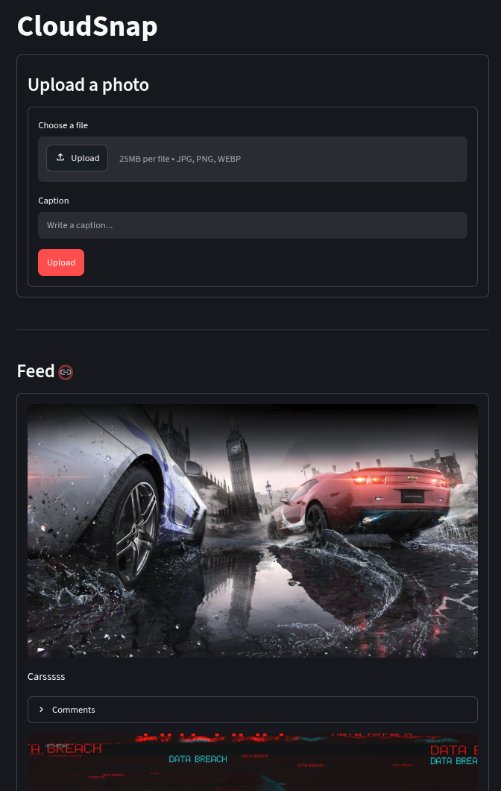
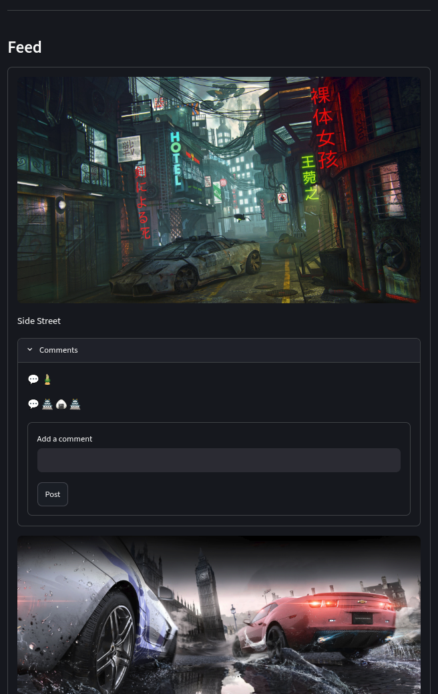
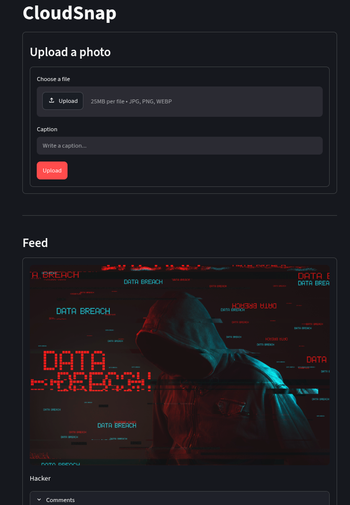

# CloudSnap

**A production-grade post sharing platform**

CloudSnap lets users upload photos with captions and share them in a live feed, built with the same architecture patterns used in real production systems

Under the hood, every image is validated, securely stored in **Amazon S3**, and served globally through **Amazon CloudFront** for near-instant load times anywhere in the world. The backend runs on **FastAPI** with full async support, so it stays fast and responsive even under load.


## Overview
 
The platform allows users to upload photos with captions, browse a paginated feed, and engage through comments. All media assets are offloaded to Amazon S3 and served globally through Amazon CloudFront, while structured metadata (photos, comments) is persisted in a relational database via an async ORM layer. Database schema evolution is managed through Alembic migrations, ensuring safe and versioned changes across environments.


## Architecture Highlights

- **Cloud-native storage** — Photos are stored in Amazon S3 and served through Amazon CloudFront, decoupling file storage from the application server for reliable, low-latency delivery.
- **Validated uploads** — Every file is verified as a genuine image using Pillow (not trusted by extension or MIME type alone), checked against an allowed-type list, and capped by size before being accepted.
- **Rate-limited endpoints** — Upload and comment routes are throttled per client IP to prevent abuse and protect backend resources.
- **Fully asynchronous backend** — Built on FastAPI with async SQLAlchemy sessions, so upload and database operations don't block the event loop under concurrent load.
- **Transactional integrity** — If a database write fails after a successful upload, the corresponding S3 object is automatically removed to prevent orphaned files.
- **Paginated APIs** — Photo and comment endpoints support limit/offset pagination, keeping response times consistent as data grows.

---
 
## Tech Stack
 
| Layer | Technology |
|---|---|
| Language | Python |
| Backend Framework | FastAPI (async) |
| Frontend | Streamlit |
| ORM | SQLAlchemy 2.0 (Async) |
| Migrations | Alembic |
| Object Storage | Amazon S3 |
| Content Delivery | Amazon CloudFront |
| Rate Limiting | SlowAPI |
| Image Processing | Pillow (PIL) |
| Cloud SDK | Boto3 |
 
---


---

## AWS Services Used
 
| Service | Purpose |
|---|---|
| **Amazon S3** | Primary object store for all uploaded photo assets. Files are streamed to S3 using async-safe threadpool execution to avoid blocking the event loop. |
| **Amazon CloudFront** | Acts as the CDN layer in front of S3, serving photos to end users with reduced latency and offloading direct traffic from the storage bucket. |
| **AWS IAM** | Programmatic access to S3 is scoped through IAM access key credentials, following least-privilege access principles. |
| **Amazon RDS** | Managed relational database backing the application's persistent storage (photos, comments), accessed via the async SQLAlchemy/Alembic layer. |
 
---


---
 
## Database & Migrations
 
The data layer is built on **SQLAlchemy 2.0's async ORM**, using a fully typed, declarative model structure:
 
- **`Photo`** — Stores the S3 object key, caption, and creation timestamp.
- **`Comment`** — Linked to a `Photo` via a foreign key, with cascading delete behavior (`ON DELETE CASCADE`) to maintain referential integrity.
Schema changes are **not** applied via `create_all()`. Instead, the project uses **Alembic** for version-controlled, incremental migrations — enabling safe schema evolution across development, staging, and production environments without data loss.

---
 
## Security Considerations
 
- Server-side image verification (beyond MIME/extension trust)
- Enforced maximum upload size to prevent resource exhaustion
- Rate-limited write operations to mitigate abuse and spam
- Explicit CORS origin whitelisting
- Least-privilege AWS IAM credentials for storage access
- Automatic rollback and S3 cleanup on failed database writes, preventing orphaned files
---


---
 
## Web Interface
 
<table>
<tr>
<td></td>
<td></td>
<td></td>
</tr>
</table>
---


 
## Environment Configuration
 
The application is fully configuration-driven via environment variables:
 
| Variable | Description |
|---|---|
| `DATABASE_URL` | Async-compatible database connection string |
| `BUCKET_NAME` | Target S3 bucket for photo storage |
| `CLOUDFRONT_DOMAIN` | CloudFront distribution domain for serving media |
| `ALLOWED_TYPES` | Comma-separated list of accepted MIME types |
| `EXTENSION_MAP` | JSON mapping of MIME types to file extensions |
| `MAX_FILE_SIZE` | Maximum allowed upload size (bytes) |
| `aws_access_key_id` | AWS IAM access key |
| `aws_secret_access_key` | AWS IAM secret key |
 
---

##  Installation & Setup

### 1. Clone the Repository

```bash
git clone https://github.com/<your-username>/CloudSnap.git
cd CloudSnap
```
Sync through uv

! install the uv in not already installed
```aiignore
uv sync
```

Configure Environment Variables

Go to the .env file and add your required keys and configuration values.

Configure Database

Open alembic.ini and add your PostgreSQL database URL:
```aiignore
sqlalchemy.url = your_database_url
```
Run 
```aiignore
uv run alembic revision --autogenerate -m "First initialization"
uv run alembic upgrade head
```
```aiignore
uv run fastapi dev FAPI.py
```
Open another terminal and run
```aiignore
uv run streamlit run UI.py
```

